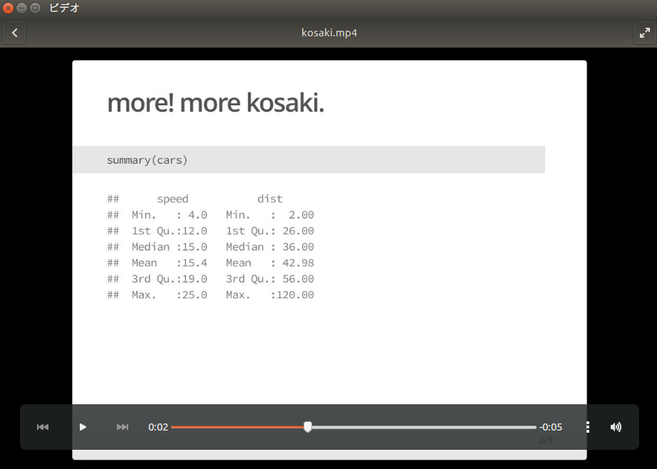
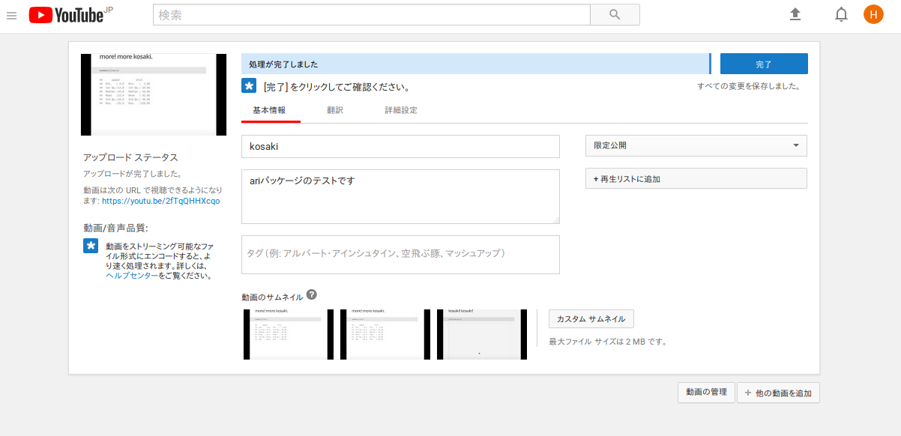
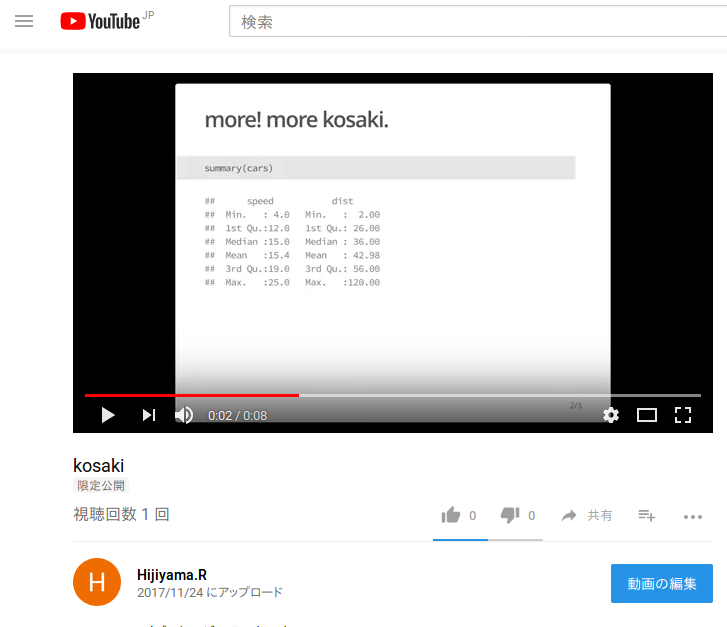
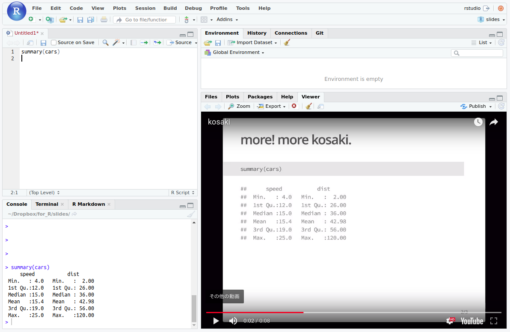

```{r setup, include=FALSE}
knitr::opts_chunk$set(echo = TRUE,
                      warning = FALSE, 
                      message = FALSE)
```

# はじめに

## 自己紹介 {.twocol}

### {.left}

- 前田 和寛
- 比治山大学短期大学部
- @kazutan
    - twitter
    - GitHub
    - Qiita

### {.right}


## 今回のお話

- youtubeRになるには
- ariパッケージ
- 実行環境の整備
- さいごに

# YouTuberになりたい

## 動機

お小遣い，ほしい。

## どうやったらYouTuberになれる?

- 需要のある動画をつくる
- 投稿する
- 告知する

あとはこれをコンスタントに実施

## でも、うちRおじさんだし…

- トピックをRにしよう
    - 国内向けのWebinerはあまりない
    - でも間違いなく需要はある
    - これはチャンス!?

# 要件の整理

## コンテンツを作成

- RのコンテンツだからRで作りたい
    - できればRmdで作ったスライドを活用したい
    - ムービーだから音声必須
    - いちいち録画/録音したくない
- ariパッケージで作ろう

## youtubeにて公開

- youtubeのアカウントが必要
- 自分のyoutubeチャンネルを準備
    - まあ細かいところはなんとかなるでしょう

## ユーザー環境の整備

- Rのコンテンツ
    - R入門とかそういうのがウケるはず!
    - でもブラウザとRStudioいったりきたりは面倒
- RStudio上でyoutubeを再生できればOK
    - tubeplayRパッケージ
    - RStudio Server構築の簡素化

# ムービー作成

## ariパッケージ

- Rmdから生成したhtmlスライドからmp4ムービーを生成
    - 主に以下のRmdスライドに対応
        - ioslides_presentation
        - slidy_presentation
        - xaringan::moon_reader
    - 読み上げ原稿はRmdに仕込める
        - 音声は自動生成
    - 原稿にあわせてスライドも自動で切り替わる
        - タイミングも全自動で抽出

超簡単!

## 生成は`ari::narrate()`

```
ari_narrate(script, slides, output = "output.mp4", voice,
  capture_method = "vectorized", ...)
```

- script: 読み上げる原稿があるファイル
    - 詳細は後述
- slides: htmlスライド
    - Rmd直接ではなく，renderした後のhtmlスライドファイル
- output: 出力ファイル名
- voice: 声の選択(後述)
- capture_method: スライドをキャプチャする方法
    - 詳細は後述

## 実行例

`kosaki.Rmd`というioslidesで準備したファイル:

```
    ---
    title: "More Kosaki!"
    output: ioslides_presentation
    ---
    
    <!-- タイトルスライド用原稿 -->
    
    ## more! more kosaki.
    `r ''````{r cars, echo = TRUE}
    summary(cars)
    `r ''````
    <!-- 二枚目の原稿をひたすら綴る。-->
    ## kosaki! kosaki!
    `r ''````{r pressure}
    plot(pressure)
    `r ''````
    <!-- 三枚目の原稿を綴る -->
```


---

mp4を生成するコードは以下の通り:

```{r, eval=FALSE}
# まずはrender
rmarkdown::render("kosaki.Rmd", output_file = "kosaki.html")

# mp4を生成するコード
ari::ari_narrate("kosaki.Rmd", slides = "kosaki.html", output = "kosaki.mp4",
                 voice = "Mizuki", capture_method = "iterative")

```

- ところが，**何も準備しないとエラーが出て生成されない**
- 実はariパッケージはいろんなものを使って生成してる
    - というわけで，仕組みと環境構築を解説

# ariパッケージの仕組みと環境構築

## ariパッケージの処理フロー

1. `slides = `のhtmlスライド一枚一枚をwebshotで画像にする
1. `script = `内容から，各スライドの読み上げ原稿を抽出
1. 読み上げ原稿をAWS Pollyというサービスに投げて音声ファイルを取得
1. 音声ファイルの長さから，各スライドの表示時間を計算
1. 画像・音声と表示時間を元にffmpegで動画生成

## ariパッケージに必要な環境

- PhantomJS
    - webshotパッケージが利用しているヘッドレスブラウザ
- AWS PollyのAPIが使える環境
    - AWSアカウント
    - AWS Pollyが使えるトークン
- ffmpeg
    - Pathが通っている必要あり

…道は険しい。

## PhantomJSの導入

1. Rでwebshotパッケージをインストール
2. `webshot::install_phantomjs()`でOK
    - 各OSに応じて自動的にインストールされる
    - うまくインストールできない場合は，手動でインストールしてください

- webshotパッケージについては，以下のページを参照してください:
    - webshotパッケージ - Kazutan.R
    - https://kazutan.github.io/kazutanR/webshot_demo.html

## AWS Pollyが使える環境

- AWSのサービスのひとつ
    - テキストから音声データを生成
    - 詳しくはググってください
- ariパッケージはaws.pollyパッケージを利用
    - Cloudyrプロジェクトの一環
    - 興味がある方は「aws.polly r」でググッて
- 日本語にも対応
    - `voice`で読み手を指定できる
    - 日本の女性は`voice = "Mizuki"`

---

やることは以下の通り:

- AWSのアカウント取得
- AWS Pollyが使えるトークンを発行(説明省略)
- トークンの内容をRの設定として登録:

```{r, eval=FALSE}
# 上2つは架空の文字列です
Sys.setenv("AWS_ACCESS_KEY_ID" = "KOSAKIKOSAKIKOSAKIKO",
           "AWS_SECRET_ACCESS_KEY" = "KosakiKosakiKosakiKosakiKosakiKosakiKosa",
           "AWS_DEFAULT_REGION" = "ap-northeast-1")
```

- これらを設定しとけばOK
    - ただ，これら**トークン情報をRConsoleに直接入力するのは避けよう**

## ffmpegの準備

- コマンドラインから各種フォーマットのメディアを生成するアプリケーション
    - オープンソースでwindows, mac, 主要linuxディストリで利用可能
- 以下の公式サイトからダウンロード
    - https://www.ffmpeg.org/download.html
- Debian, UbuntuならaptでもOK
    - ただし，対応codecが含まれていないとだめ
    - 最終的にbuildしなきゃならん場合も...

## これで準備は整った

ariパッケージのインストール

```{r, eval=FALSE}
# cranから
install.packages("ari")

# githubはこちら(2017/11/24時点ではcranと同じ)
devtools::install_github("seankross/ari")
```

`ari::narrate()`を実行

```{r, eval=FALSE}
# mp4を生成するコード
ari::ari_narrate("kosaki.Rmd", slides = "kosaki.html", output = "kosaki.mp4",
                 voice = "Mizuki", capture_method = "iterative")
```

## Yeah!




# YouTubeへ公開しよう

## アカウント・チャンネルの準備

まあてきとうにやっといてください。

## 動画のアップ

mp4形式ならすんなりと公開できます:



## OKできたぞい



# Rユーザーに最適な<br/>YouTube体験を

## Rの動画をみながら作業するには

- RStudioは画面を専有する
    - tear(ウィンドウ切り離し)もある
    - でも結構面倒
- ブラウザとRStudioを行き来するのは面倒
    - アクティブウィンドウの切り替えが面倒

**RStudioでYouTubeを再生できれば解決!**

## tubeplayRパッケージ

- RStudioのViewerでYouTubeを再生できるパッケージ
    - Win, Linux版ではRStudio Server版のみ
    - Macならデスクトップ版でも動作
- GitHubでのみ公開
    - `devtools::install_github("kazutan/tubeplayR")`
    - もしくは`githubinstall::githubinstall("tubeplayR")`
- 再生したいYouTubeのurlをコピーして関数へ
    - `tubeplayR::tubeplay("ここにurlを")
- 詳しくは以下のスライド資料を
    - https://kazutan.github.io/HijiyamaR6/intro_tubeplayR.html#/

## これだ...!!



# 改善と補足

## 環境準備が大変

- いろいろ事前の準備が大変
    - Rのパッケージ外でもいろいろ
    - 設定とか面倒
- アプリケーションをあまり追加したくない
    - 都合上あまり汚したくない
    - そもそもアプリをインストールできないことも

## docker、準備しました

- kazutan/zousan-r:tube_box
    - rocker/tidyverseをベース
        - tidyverseパッケージ全部入り
        - Debianベース
    - Rの日本語化済、IPAexフォント導入済
    - ariパッケージまで導入済
- AWSのトークンさえあればOK

```
$ docker pull kazutan/zousan-r:tube_box
$ docker run -p 8787:8787 -v ~:/home/rstudio -d --name kosaki kazutan/zousan-r:tube_box
```
## 補足 読み上げ原稿について

- `script`にmdファイルを与えた場合、renderして生成されたhtmlファイルのpタグひとつ分をスライド1枚分の原稿として処理
    - 見出しは原稿から無視
- `script`にRmdファイルを与えた場合、htmlコメント(`<!-- 文字列 -->`)一つ分をスライド1枚分の原稿として処理
    - htmlコメント以外は原稿から無視

状況や好みに応じて使い分ければ便利

## 補足 画像解像度について

- `ari::narrate()`の`...`はwebshotの引数として引き渡される
    - 解像度とかヘッドレスブラウザへ情報を送ることも可能
- ただし、解像度以外はいじらないほうがいい
    - htmlスライドはそれぞれ独自のエンジンで実現
    - 細かくやりたい場合はそれぞれの仕様をよく確認すること

## 補足 AWS Pollyの料金について

- 契約1年目は200万文字/月まで無料
- それを超えてもごくわずか
- 多分1年超えてもそれほどの金額ではない
- よほどのものを作り続けない限り心配なし!

## 補足 音声のみを生成したい

- ariパッケージではできない
- でもAWS.Pollyパッケージならいけるはず
    - このパッケージはまさに読み上げデータを取得するもの
    - こちらについては、各自で確認をおねがいします

# さいごに

## めざしたかったのはR教育のコンテンツ充実

- 教育に関わって10年で感じてたこと
    - よくe-learningとか言うじゃないですか
    - 確かにオンラインで学べればメリットは多い
    - でも**一番大変なのはコンテンツを揃えること**
- これが最もコストがかかる
    - 多くの大学教育においてもこれが課題
    - 揃えなければ意味がない
    - でもそれで本業がおろそかになっては意味がない

## Rの初心者講習のつらさ

- Rの勉強会で初心者講習は必須
    - この議論については以下を参照
    - https://kazutan.github.io/RUserMeeting2016/RUserMeeting2016.html#/
- でもよくミスマッチが発生
    - たった1時間くらいでRに馴染めるはずがない
    - 継続的な経験、および反復が必要
    - そして「人によって習得状況が様々」
- 多様なコンテンツを提供しないといけない

## 最終的には自学自習しかない

- 最初は資料に基づくコード写経
    - できるだけリッチなメディアコンテンツを届けたい
    - そして多様性とボリュームが必要となる
- 今回の提案はそれを促進させるもの
    - コンテンツ作成がかなり容易に
    - また作成・公開する側にも(多少)Payがある
- 質問したければr-wakalangがある
    - たとえ身近に聞ける人がいなくてもいい

オンラインこそが、充実した学習環境になる

## Hijiyama.Rは終わるけど

でも全国各地でRを楽しめればいいじゃない。

私はこれからも楽しんでいきます。

## Enjoy!


