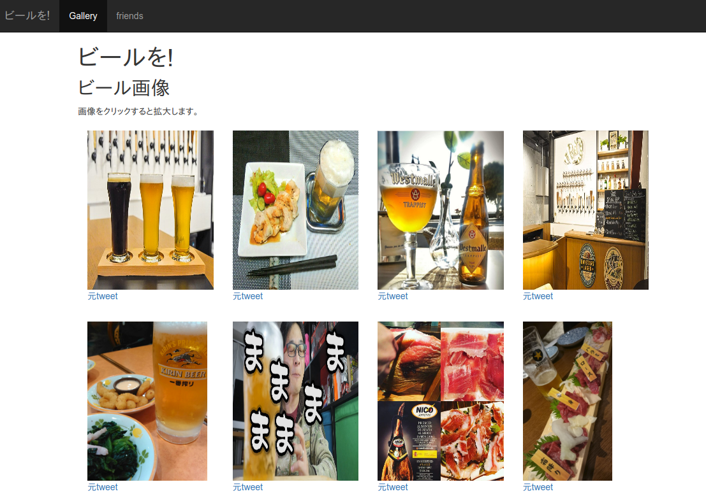
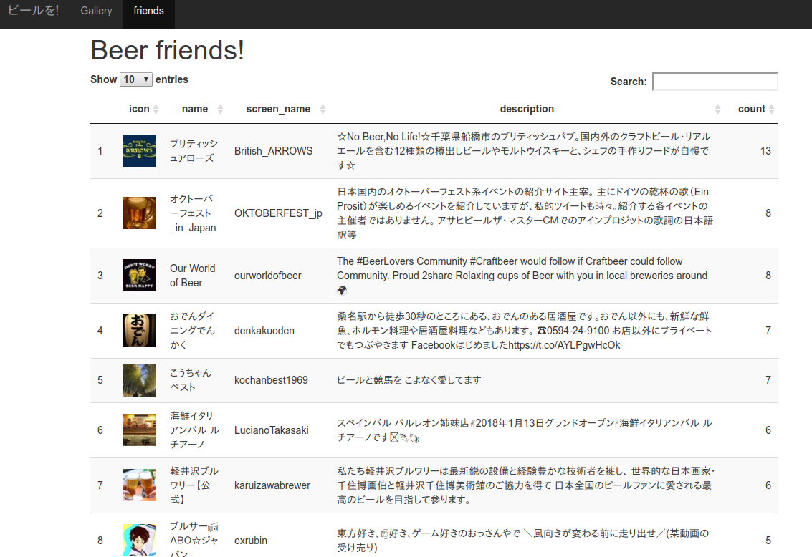

```{r setup, include=FALSE}
knitr::opts_chunk$set(echo = TRUE,
                      eval = FALSE,
                      warning = FALSE, 
                      message = FALSE)
```

# 自己紹介

### プロフィール

.column[
- 前田 和寛
- 比治山大学短期大学部
- @kazutan
    - twitter
    - GitHub
    - Qiita
]

.column[


]

---

# 今回の目標

- 私はビールが大好き
- ビール画像を収集したい
- Twitterにあふれている!
- よしこれを収集してギャラリーを作ろう
- もちろん、Rで

---

# 完成例(キャプチャ画像)



---



---
layout: true

# 0 要件整理

---

### 目標

- TwitterからAPIを叩いてほしいツイートを取得
- 取得したデータを整形して必要なデータのみに
- データからWebサイト用のhtmlコンテンツを生成
    - htmltoolsパッケージを利用
    - htmlwidgets系も利用
- ギャラリー用Webサイト作成
    - ついでに「よくビール画像をつぶやくアカウントを探してみよう
    - それを表にしてまとめてみよう

今回はこの内容に合わせてRStudioでプロジェクトを作成して作業することを前提にします

---

### 細分化(1) Twitterからデータ取得

- TwitterのTokenを取得
- RにTokenを読み込ませる
- rtweetパッケージを利用してデータを取得

---

### 細分化(2) 取得したデータを整形

- dplyr, tidyrを駆使する
- 絞り込みは主観的なもので
- あわせて高頻度でビール画像を投下するアカウントを抽出
    - これらのアカウントに対して、rtweetを利用してユーザーデータを取得

---

### 細分化(3) データからWebサイト用のhtmlコンテンツを生成

- 整形したデータを利用してhtmlタグを錬成する
    - htmltoolsを活用してまとめて生成
    - 生成したタグをhtmlファイルで吐き出す
- ビールなやつ一覧表はDT::datatableを活用
    - 生成した表はsaveWidgetsで吐き出す

---

### 細分化(4) ギャラリー用Webサイト作成

- rmarkdown::render_siteで錬成
    - すでに作成したhtmlコンテンツを個別のRmdファイルに流しこむ
    - Rチャンクオプションのchildを利用
- outputにはzousan::zousan_documentを利用
    - lightboxを楽に使いたかったため
    - すみませんこれ自作の個人用です
    - html_documentの拡張ですので、html_documentと同じように使えます

---
layout: true

# 1 Twitterからデータ取得

---

### 1.0 ここでやること

1. TwitterのTokenを取得
2. RにTwitter Tokenを読み込ませる
3. rtweetを利用してデータを取得

---

### 1.1 TwitterのTokenを取得

ごめんなさいググッて調べてください

今回は、`.rtweet-token`というファイルを準備しました:

```
1行目: アプリ名
2行目: consumer_key
3行目: secret_key
4行目: (空行)
```

これを読み込ませることでRに認証させます

---

### 1.2 RにTwitter Tokenを読み込ませる

- `rtweet::create_token()`でトークン取得
    - 認証情報はEnvironmentとして保持される
    - これらの情報は残らないよう気をつける

```{r}
# パッケージ読み込み
library(rtweet)

# twitterのトークンを取得
twitter_token <- create_token(
  app = readLines(".rtweet_tokens")[1],
  consumer_key = readLines(".rtweet_tokens")[2],
  consumer_secret = readLines(".rtweet_tokens")[3]
)
```

---

### 1.3 ビール関連ツイートを取得

- `rtweet::search_tweets()`でツイートを取得
    - 第一引数に検索させたいクエリを文字列で
    - 認証したアカウントで閲覧できるツイートから取得
    - ただし通常のトークンでは**約一週間分**のみ
    - retweetを含むかどうかは引数で指定

```{r}
# 過去一週間のビール関連ツイートを取得(RTなし)
rt <- search_tweets("#ビール", n = 10000, include_rts = FALSE)
```

---
layout: true

# 2 取得したデータを整形

---

### 2.0 ここでやること

- ビール画像ツイート情報を作成
    - ビール関連ツイートから画像を含むツイートを抽出
    - ふぁぼ、RTがそれぞれ1つ以上に絞る
    - ツイートへのリンクurlを準備
- beer friendsリスト作成
    - アカウントでgroup_by
    - 件数をcount
    - 3件以上を抽出して降順に並べ替え
- beer friendsのユーザーデータ情報を準備
    - beer friendsのリストをrtweetに投げて取得
    - アイコンなどユーザー情報を整理

---

### 2.1 ビール画像ツイート情報を作成

- いわゆる前処理
    - rtweetで取得したデータは、一部nestされている(list)列があるので注意

```{r}
beer_df <- rt %>% 
  select(status_id, created_at, user_id, screen_name, text, media_url, retweet_count, favorite_count) %>% 
  unnest() %>% 
  drop_na(media_url) %>% 
  mutate(url = paste0("https://twitter.com/", screen_name, "/status/", status_id)) %>% 
  filter(favorite_count >= 1, retweet_count >= 1)
```

---

### 2.2 beer friendsリスト作成

- アカウントで集計
    - さきほど作ったbeer_dfから作成
    - ほしいのは件数だけなので`dplyr::n()`でOK

```{r}
beer_friends <- beer_df %>% 
  group_by(screen_name) %>% 
  summarise(count = n()) %>% 
  arrange(desc(count)) %>% 
  filter(count >= 3)
```

---

### 2.3 beer friendsのユーザーデータ取得

- `rtweet::lookup_users()`でまとめて持ってこれる
    - あとは適宜修正し、2.2で算出した件数をjoinさせる

```{r}
beer_friends_user_df <- lookup_users(beer_friends$screen_name) %>% 
  select(user_id, name, screen_name, location, description, profile_image_url) %>% 
  mutate(url = paste0("https://twitter.com/", screen_name)) %>% 
  left_join(beer_friends, by = "screen_name")
```

---
layout: true

# 3 Webサイト用コンテンツ作成

---

### 3.0 ここでやること

- ビール画像ギャラリーを作成
    - htmlファイルとして書き出す
    - 画像・元ツイートへのリンクをセットにして、divで個別梱包
    - bootstrapで扱いやすいように
- beer friends一覧表を作成
    - `DT::datatable()`でhtmlwidgets化
    - あとはseveWidgetで書き出しておく

---

### 3.1 ビール画像ギャラリーを作成

```{r}
# ギャラリー生成用関数の準備
fn_gallery <- function(src, alt, base_url) {
  tags$div(class = "col-sm-3 unit",
           tags$img(src = src, alt = alt),
           tags$br(),
           tags$a(href = base_url, "元tweet")
           )
}
```

---

```{r}
# ギャラリーのコンテンツを一気に作成
beer_gallery_contents <- mapply(fn_gallery,
                                src = beer_df$media_url,
                                alt = beer_df$text,
                                base_url = beer_df$url,
                                SIMPLIFY = FALSE,
                                USE.NAMES = FALSE)
```

---

```{r}
# コンテンツをdivに括って文字列化
div_beer_gallery <- tags$div(class = "images", beer_gallery_contents) %>% 
  as.character() %>% 
  str_replace_all("\n +", "\n")

# htmlファイルとして書き出し
writeLines(div_beer_gallery, "_div_beer_gallery.html", sep = '')
```

---

### 3.2 beer friends一覧表を作成

```{r}
# imgタグをaタグで覆うための関数を準備
make_icon_tags <- function(src, href) {
  tags$a(href = href,
         tags$img(src = src)) %>% 
    as.character()
}

# 一覧表用のdata.frameを作成してそのまま表へ
beer_friends_user_table <- beer_friends_user_df %>% 
  mutate(icon = mapply(make_icon_tags, .$profile_image_url, .$url, SIMPLIFY = FALSE, USE.NAMES = FALSE)) %>% 
  select(icon, name, screen_name, description, count) %>% 
  datatable()

# htmlwidgetsとして保存
saveWidget(beer_friends_user_table, file = "_beer_friends_table.html")
```

---
layout: true

# 4 ギャラリー用Webサイト作成

---

### 4.0 ここでやること

- Webサイト用のファイルを準備
    - 扉になる`index.Rmd`
    - ギャラリー用`beer_gallery.Rmd`
    - beer friends用`beer_friends.Rmd`
    - サイト設定用`_site.yml`
- サイトを一発でレンダリング
    - コマンド1行でOK

---

### 4.1 Webサイト用のファイルを準備

扉となるindex.Rmdを以下のように準備

```markdown
---
title: "ビールを!"
---

## コンセプト

(以下ただの文章なので省略)

```

---

ギャラリー用のbeer_gallery.Rmdを準備(バックスラッシュは無視してください)

````markdown
---
title: "ビールを!"
---

## ビール画像

画像をクリックすると拡大します。

\```{r, child="_div_beer_gallery.html"}

\```
````

---

beer friends用のbeer_friends.Rmdを準備(バックスラッシュは無視してください)

````markdown
---
title: Beer friends!
output:
  zousan::zousan_document:
    lightbox: false
    self_contained: false
---

\```{r, child="_beer_friends_table.html"}

\```
````

---

サイト設定用の_site.ymlを準備

```yaml
name: "ビールを!"
navbar:
  title: "ビールを!"
  type: inverse
  left:
  - text: Gallery
    href: beer_gallery.html
  - text: friends
    href: beer_friends.html
date: "`r format(Sys.time(),'%Y/%m/%d')`"
exclude: ["csvs"]
output:
  zousan::zousan_document:
    lightbox: true
    self_contained: false
output_dir: docs
```

---

### 4.2 サイトをレンダリング

この1行でOK

```{r}
rmarkdown::render_site(output_format = "zousan::zousan_document")
```

今回の場合、`docs`ディレクトリにWebサイトに必要なファイルがすべて生成されます

---
layout: false

# さいごに

これはあくまで趣味でつくったものなので、本番環境でやろうと思うなら別の手法をおすすめします

今後の予定:

- RDBにデータをためる
- もうちょっとバリエーションを増やす
- レコメンド機能

---

# Enjoy!

### 参考資料

- [rtweetパッケージ](http://rtweet.info/)
- [データハンドリング - Kazutan.R](https://kazutan.github.io/kazutanR/data_handling.html)
- [R Markdown入門 - Kazutan.R](https://kazutan.github.io/kazutanR/Rmd_intro.html)
- [htmltoolsパッケージでHTMLタグを生成する](https://qiita.com/kazutan/items/897a5f78846ebe185485)
- [R MarkdownでWebサイト生成しよう](https://kazutan.github.io/RmdSite_tuto/)


