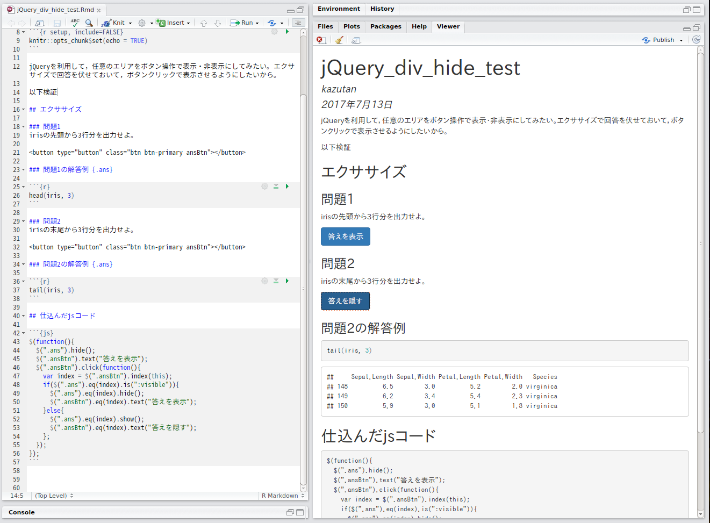
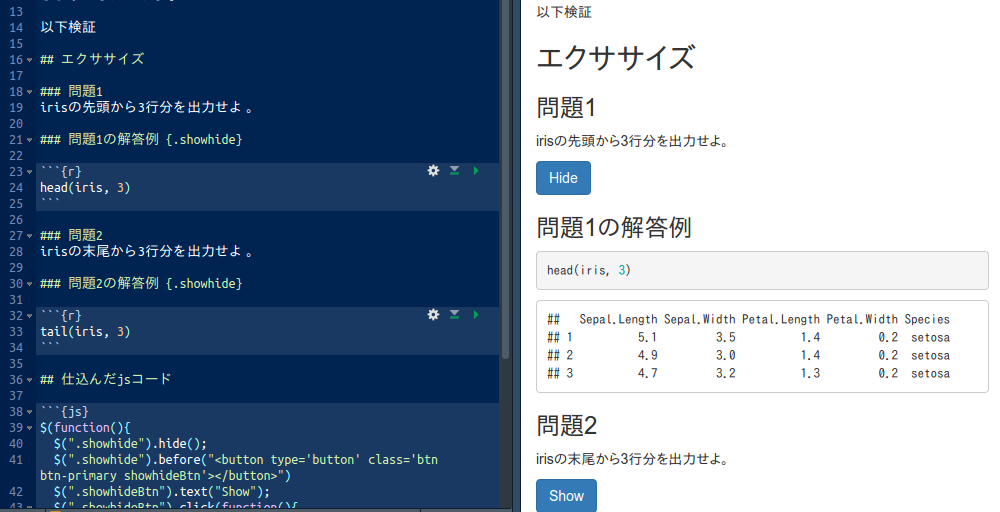
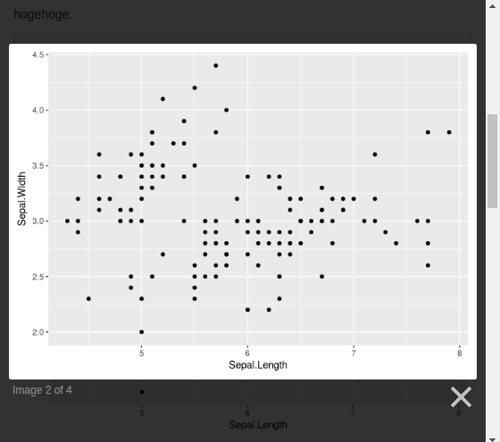
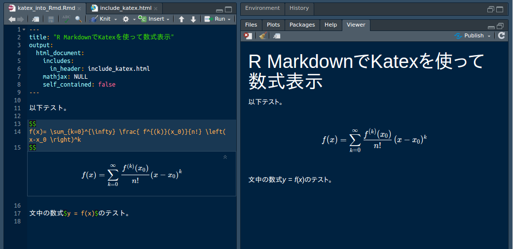

<!-- 聞こえてますでしょうか。それでは発表します。 -->

```{r setup, include=FALSE}
knitr::opts_chunk$set(echo = TRUE,
                      warning = FALSE, 
                      message = FALSE)
```


# 自己紹介

### プロフィール

.column[


- 前田 和寛
- 比治山大学短期大学部
- @kazutan
    - twitter
    - GitHub
    - Qiita
]

.column[
本日は本人が仕事のため、AWS PollyのMizukiさんに読み上げてもらいました。

このスライドも動画もRで作成しています。

気になる方は`#hijiyamaR`でツイッター検索するか、`#おしえてぞうさん`タグをつけて聞いてください。
]

<!-- まずは自己紹介です。「かずたん」とか「ぞうさん」とかよく呼ばれています。このアイコンでいろいろやってます。気になる方は探してみてください。また、本日は本人が仕事のため、AWS PollyのMizukiさんに読み上げてもらいました。 -->

---

# 今日のお話

「R Markdownでこういう機能とかあればいいのになぁ」と思うことはありませんか?

でも「R Markdownにはそんなの実装されてねぇ」とあきらめていませんか?

そんなR Markdownの殻を破ってみたい、そう私は思うようになりました。

今回は私がいままでやってみた中で、紹介しやすいのを集めてみました。

<!-- 今日のお話です。要するにぞうさんがやってきたマニアックな「アールマークダウン」の小技集を紹介するっていう話です。ソースコードもぱっぱと流すので、詳しいことは本人に直接聞いてください。　-->


---
layout: true

# 1. ボタンひとつで表示・非表示の切り替え

---

### 教材作るのに欲しかった

- ボタンをクリックすると「表示・非表示」が切り替わる
    - 教材みたいなのを作ってると欲しくなる
    - でもできれば簡単に

けどそんな機能はもちろんない。

なら、実装しよう。

<!-- ひとつ目のお話です。教材づくりにこういうのがあればなぁと思って、やってみたそうです。何を考えてるんでしょうね。-->

---

### 実装してみた



<!-- その結果がこちらです。できちゃいました。いえーい。-->

---

### アプローチ

jQueryを利用しよう
- 対象の領域にclass属性を付与
    - rmarkdown(Pandoc)の仕組みを活用
- 付与したclassを目印に、その上にボタンを出す
- クリックイベントで対象を変化させる
    - DOMを配列で取得しておく
    - あとはクリックイベントに対応させる

あとはこれを`<script>`タグで埋め込めればOK

<!-- どうやったかというと、ジェイクエリのコードを仕込みました。よくわからない文章ですが、きっと本人もいまいちわかってないと思います。-->

---

### 使用したスクリプト

```
<script type="text/javascript">
$(function(){
  $(".showhide").hide();
  $(".showhide").before("<button type='button' class='btn btn-primary showhideBtn'></button>")
  $(".showhideBtn").text("Show");
  $(".showhideBtn").click(function(){
    var index = $(".showhideBtn").index(this);
    if($(".showhide").eq(index).is(":visible")){
      $(".showhide").eq(index).hide();
      $(".showhideBtn").eq(index).text("Show");
    }else{
      $(".showhide").eq(index).show();
      $(".showhideBtn").eq(index).text("Hide");
    };
  });
});
</script>
```

<!-- こちらが本人が書いたスクリプトです。汚いのは、本人がコーディングスタイル勉強してない証拠ですね。もうちょっと勉強したほうがいいと思います。-->

---

### Rmd側の設定と結果



<!-- さっきのを仕込むと、見出しタグにちょろっと書き込むだけで、下位レベルの内容をまるっと閉じ込めることができるようになります。これは確かに使いドコロがありそうですね。そこは褒めときます。-->

---
layout: true

# 2. 画像をクリックしたら拡大表示

---

### plotを大きくして眺めたい

- plotをドキュメントに埋め込める
- でもわりと小さく出る
- どうせなら大きく見せたい

### jsライブラリがある

- この手のjsライブラリは結構ある
- 今回はlightbox2というを使えるようにしてみる

<!-- ふたつ目のネタです。ウェブで、画像をクリックしたらボワーンって出てくるのがありますよね。それを「アールマークダウン」でやってみたそうです。これはリクエストがあって試してみた、そう本人が言ってますが、きっといい口実ができたと思ってますよ。まったく。-->

---

### アプローチ

- lightbox2の読み込み
    - 面倒なのでCDNを利用
    - そのためのタグはincludes - in_headerで読み込ませる
- 出力されたhtmlタグを加工
    - imgタグをかき集める
    - lightbox2向けにclass属性を付与
    - あとはゴミを処理
    - これらをjQueryで

<!-- どうやってやったかというと、「ライトボックス2」というジャバスクリプトのライブラリを利用したみたいです。まあそれを効率よく読み込んだ上で、それがうまく動くようにジェイクエリで調整したみたいです。よくやりますねぇ。-->

---

### 使用したスクリプトなど

#### in_headerで読み込ませるhtmlコード

CDNから取得するタグのみ。

```
<link href="https://cdnjs.cloudflare.com/ajax/libs/lightbox2/2.9.0/css/lightbox.min.css" rel="stylesheet">
<script src="https://cdnjs.cloudflare.com/ajax/libs/lightbox2/2.9.0/js/lightbox-plus-jquery.min.js"></script>
```

#### Rmd内に入れたjsコード

DOMを取得してimgタグをaタグで挟む処理。

```
<script type="text/javascript">
$(function(){
  $("img:not(.lb-image)").wrap(function() {
    return "<a href='" + $(this).attr("src") + "' data-lightbox='" + $(this).attr("scr") + "'></a>";
  });
});
</script>
```

<!-- 実際に組み込んだ内容です。本人、スクリプトをみんなに読ませる気がないのがバレバレなスライドですね。そういえばRのコードがほとんど出てないんですけど、これでいいんですか? -->

---

### 実装できた



<!-- とはいえ、今回も実装できました。お疲れ様です。-->

---

### ポイントや注意点など

#### ポイント

- lightbox2はjQuery拡張ライブラリ
    - 先の分ではjQueryもあわせて持ってくる
    - html_documentなどjQueryをはじめから組み込んでいる場合は重なってしまうので、適切なCDNに変えてください

#### 注意点

- CDNによる実装なので、手元でRmd作成中はオンラインでないと効かない
    - jsライブラリを手元に置こうとすると、結局パッケージングが必要になる
    - これだと気楽には使えないので却下した
- self_contains: false 推奨
    - renderするときに結構重くなる
    - 最後の公開用にするときに`true`にしたほうがいい

<!-- ここは大事なのでしっかり読みます。まず、「ライトボックス2」はジェイクエリの拡張ライブラリなので、ジェイクエリが読み込まれないといけません。
あと、CDN、ようするにネット上のソースを利用しますので、オフラインでレンダリングしたり作業してもちゃんと動きません。回線はライフラインです。あとセルフ・コンテインドは切っといてください。本人は苦労していましたので。-->

---
layout: true

# 3. Katexで数式表示

---

### mathjaxじゃなくてkatex使いたい

- R Markdownは数式表示にmathjaxを利用
  - そこそこ処理が重い
  - あと「使わないほうがいい」ってのたまに見かける
- Katexがいいらしい
  - 処理が速いらしい
  - Katexはjsライブラリ
  - だったらなんとかなるんじゃない?

<!-- みっつめです。今日はこれが最後です。本人曰く、「完全に思いつき」だったそうです。多分カッコつけたかったんでしょう。-->

---

### アプローチ

- Katexの読み込み
  - 面倒なのでCDNを利用
  - そのためのタグはincludes - in_headerで読み込ませる
- Katex側の設定
  - R Markdownで普段から使ってる記法のままがいい
  - Katex側で設定が必要
  - Katex読み込みついでに設定用scriptを仕込んどく

<!-- カテフ? 読み方あってますか? これのジャバスクリプトライブラリを読み込ませる必要があったので、先ほどと同じようにやったそうです。あと、設定をマズジャックス? 読み方あってますか? と合わせるように設定をしたそうです。
そこまでするなら素直にマスジャックス使えばいいのにね。-->

---

### 使用したスクリプトなど

今回はin_headerで読み込ませるhtmlコードのみでOK。

CDNから取得するタグと、Katexが認識する数式エレメントの定義を変更:

```
<link rel="stylesheet" href="https://cdnjs.cloudflare.com/ajax/libs/KaTeX/0.7.1/katex.min.css" integrity="sha384-wITovz90syo1dJWVh32uuETPVEtGigN07tkttEqPv+uR2SE/mbQcG7ATL28aI9H0" crossorigin="anonymous">
<script src="https://cdnjs.cloudflare.com/ajax/libs/KaTeX/0.7.1/katex.min.js" integrity="sha384-/y1Nn9+QQAipbNQWU65krzJralCnuOasHncUFXGkdwntGeSvQicrYkiUBwsgUqc1" crossorigin="anonymous"></script>
<script src="https://cdnjs.cloudflare.com/ajax/libs/KaTeX/0.7.1/contrib/auto-render.min.js" integrity="sha384-dq1/gEHSxPZQ7DdrM82ID4YVol9BYyU7GbWlIwnwyPzotpoc57wDw/guX8EaYGPx" crossorigin="anonymous"></script>
<script>
  document.addEventListener("DOMContentLoaded", function() {
    renderMathInElement(document.body, {delimiters: [
      {left: "$$", right: "$$", display: true},
      {left: "$", right: "$", display: false}]
    });
  });
</script>
```

<!-- 組み込んだコードです。もうここまでくると、スライドに表示させる意味があるんですか? みなさんダメ出ししておいてください。-->

---

### テスト用のRmdファイル

こんな感じです:

    ---
    title: "R MarkdownでKatexを使って数式表示"
    output:
      html_document:
        includes:
          in_header: include_katex.html
        mathjax: NULL
        self_contained: false
    ---
    
    以下テスト。
    
    $$
    f(x)= \sum_{k=0}^{\infty} \frac{ f^{(k)}(x_0)}{n!} \left( x-x_0 \right)^k 
    $$
    
    文中の数式$y = f(x)$のテスト。

<!-- テスト用に準備した「アールマークダウン」ファイルの中身です。数式の表示方法はマークダウンでよく見るパターンですね。-->

---

### 実装できた



<!-- なんとか動きました。なのでこれでいいことにしましょう。-->

---

### ポイント

- mathjaxの解除
  - Rmdの冒頭yamlで`mathjax: NULL`とする
- katexの読み込み
  - 要するに`katex.min.js`と`katex.min.css`、そしてauto-renderのための`auto-render.min.js`をhead領域で読みこませればOK
  - CDNへのパスは必ず公式サイトを参照してください
- Katexの設定
  - ブロックとしては`$$`で、インラインでは`$`で反応するように
  - こうすれば普段使っているのと同じように利用可能

<!-- ポイントを紹介してます。まあスルーしときましょう。次が大事なので。-->

---

### 注意点

- `self_contained: false`を強く推奨
  - `true`にすると**katexをまるごとbase64enc**してしまう
  - renderにすごく時間かかってしまう
- 作業環境に注意
  - win, linuxのRStudio Desktop版だと、Viewerでうまく表示されない
  - RStudio Server版、もしくはMacでならViewerでもうまくいく
- katexとmathjaxは完全互換じゃない
  - このあたりは各自で調べてください

<!-- 注意点です。
まず、「セルフ・コンテインド」は必ずOFFにしておいてください。使い物になりません。さらに、ウィンドウズとリナックスのアールスタジオ・デスクトップ版だと、ビューワーでまともに表示されません。これはQtに関連する内容なので省略します。
ぞうさんいつもこれで頭を抱えてますねぇ。
なお、レンダリング自体には問題はないので、ブラウザで表示させればちゃんと表示されます。
以上で、今日紹介する予定のものは終了です。-->

---
layout: true

# さいごに


---

### これらはあくまで導入

JavaScript, jQuery初心者な私でもここまでできました。

これらはすべてR Markdown上で、その殻(仕様)を飛び越えるものです。

あとは「こんなのがほしい」という欲求と想像力だけです。

一緒にいろいろやっていきましょう。

<!-- 最後に、本人からのメッセージとのことです。ようするに、「こういうのに興味がある人、一緒にやりませんか」とのことですが、単に寂しいだけだと思います。残念なぞうさんです。-->

---
class: middle


### Enjoy!

参考資料

- R Markdownで任意の領域を表示/非表示ボタンの実装  
https://qiita.com/kazutan/items/2bb44f1724a8b6d04be6
- R Markdownで画像クリックしたら拡大表示させる機能(Lightbox)の実装  
https://qiita.com/kazutan/items/d617dab4f0e79b84bd76
- R MarkdownでKatexを使って数式表示  
https://qiita.com/kazutan/items/c07d317dde68b90ef118

このスライドは、`#japanR`のハッシュタグをつけてTwitterに流しますので、そちらも参照してください。

<!-- 以上で、発表を終わります。この発表スライドは、ジャパンアールのハッシュタグをつけて当日中にTwitterに流すはずですので、気になることがあれば聞いてみてください。

Enjoy!

-->


